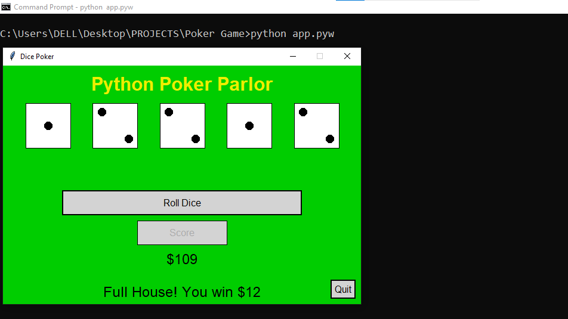

# PokerApp



A graphical user interface (GUI) Poker game implemented in Python.
Play a classic game of Poker and keep track of your winnings.

## Features

- Classic Poker game rules and gameplay.
- Graphical user interface for a more engaging experience.
- Bet and see your money increase ...or decrease😈.
- Keep track of your wins and losses.

## Getting Started

These instructions will help you get a copy of the project up and running on your local machine.

### Prerequisites

To run this project, you'll need:

- Python3.x (3.9 recommended) installed on your system.

### Installation

1. Clone the repository to your local machine:

   ```bash
   git clone https://github.com/farookie007/PokerApp.git

2. Navigate to the project directory:

   ```bash
   cd PokerApp

3. Run the Poker game:

   ```bash
   python app.pyw

## How to Play

To play the game:

1. Launch the game by running `python app.pyw`.
2. Click the 'Roll dice' button to roll the dice.
3. Examine your hand and click 'score' button to cash in your hand
4. Otherwise, choose the dice you wish to re-roll by clicking on them and once again click 'Roll dice' button.

NB: You are only allowed to re-roll twice before the game cash in your hand.

## License

This project is licensed under the GNU GENERAL PUBLIC LICENSE - see the [LICENSE.md](LICENSE.md) file for details.

## Acknowledgments

- Thanks to John Zelle's [Python Programming: An Introduction to Computer Science](https://books.google.com.ng/books/about/Python_Programming.html?id=aJQILlLxRmAC&redir_esc=y) for providing the GUI library.
